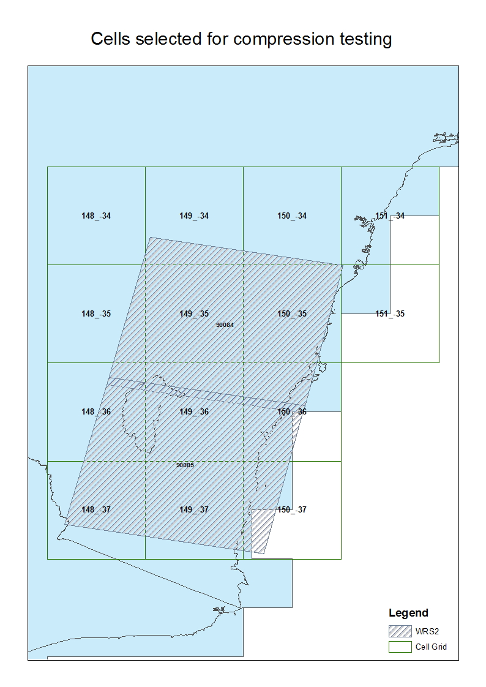
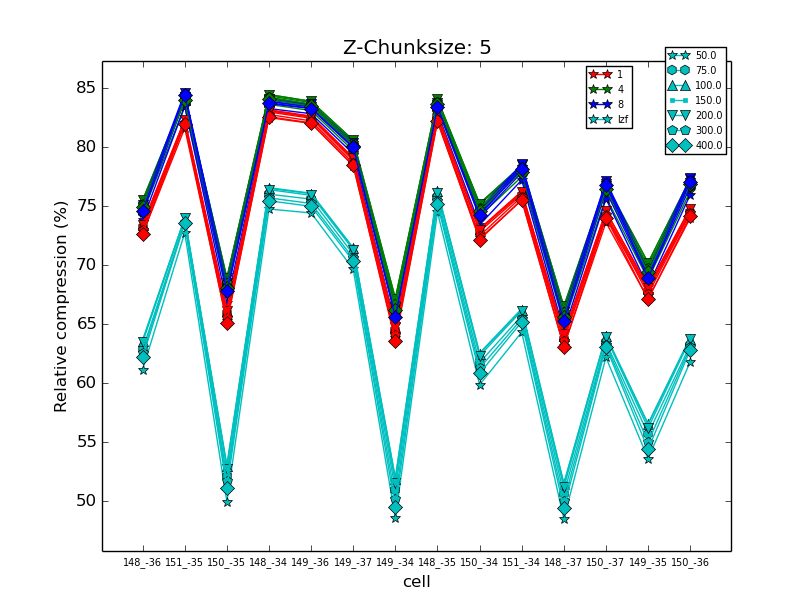
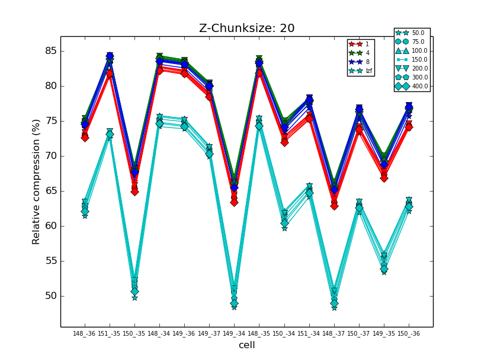
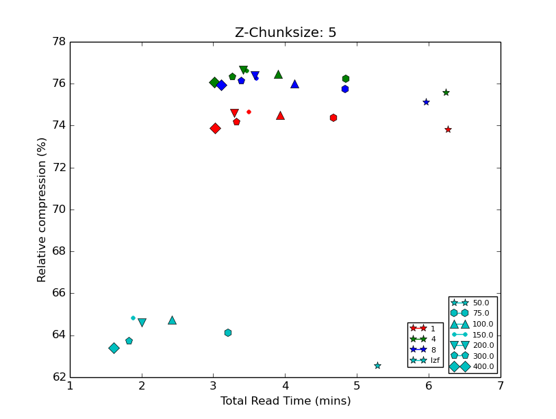
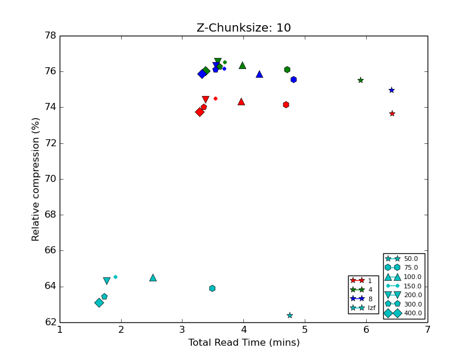
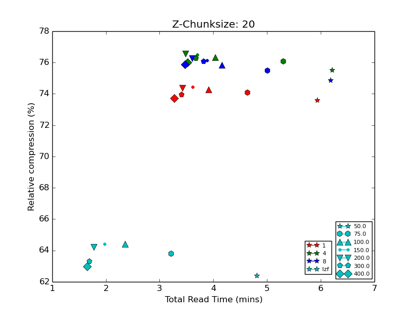
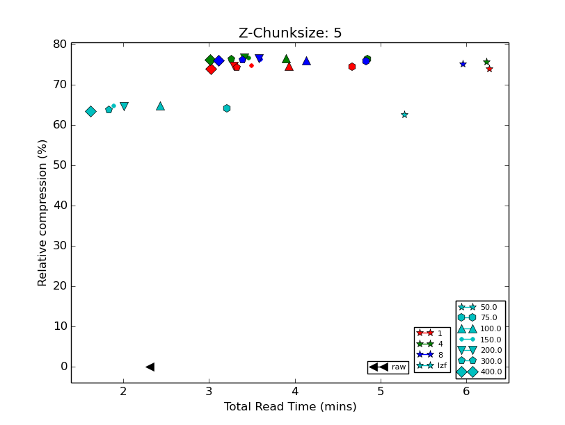
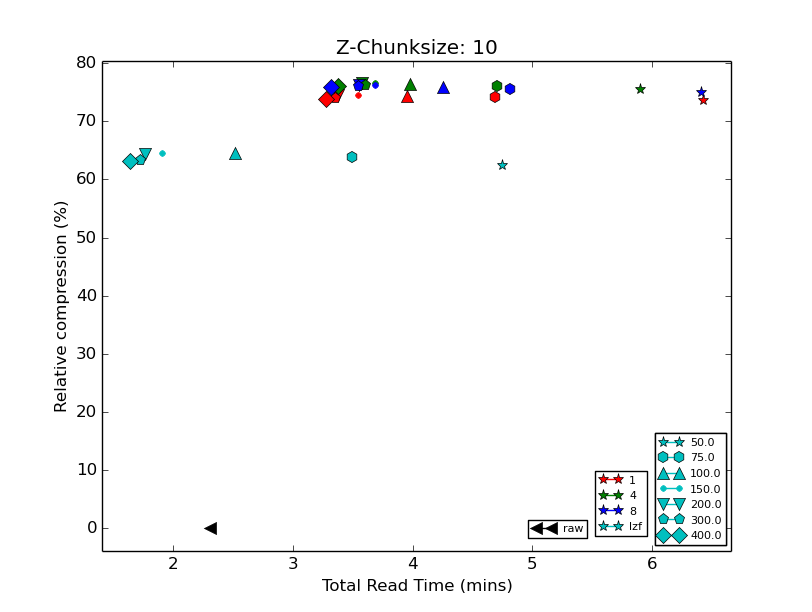
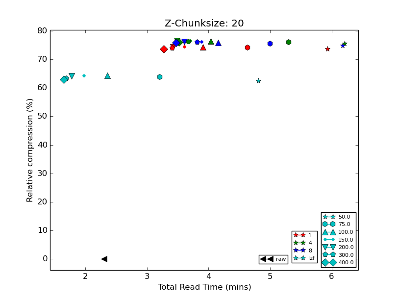

# Chunksize and Compression Level Testing

This report roughly details the comparison of differing chunksize, for not only the spatial domain (x & y),
but also the z domain, at different compression levels.

The 14 selected cells were chosen because of their spatial position relative to the WRS2 Landsat grid.
These cells will contain varying amounts of data coverage, ranging from sparse to complete coverage.

The satellite sensor selected was Landsat 8 for the year 2008. The spatial dimensions were consistently
4000 by 4000, whereas the z-axis differed from cell to cell but within the range of 13 to 23.

The z-axis chunk sizes used were 5, 10 & 20. For each z-axis chunk size, a different spatial chunk from the
following list was applied:

* 50
* 75
* 100
* 150
* 200
* 300
* 400

For each combination, a different compression algorithm from the following list was applied:

* GZip level 1
* GZip level 4
* GZip level 8
* LZF

Each compression was applied with and without a shuffle filter applied.

This number of combinations resulted in 2352 files, and for further compariason, raw files were also generated.

The following figure displays the area selected for the storge uints compression testing.
Cells that interesected the geometries of Path 90 and Rows 84/85 from the WRS2 *descending* grid, were
then used to form the data basis of this report. As one can see, the cell grid data layout results in
sparse data as well as dense data, within a given cell, for a given acquisition date.

The shuffle filter didn't have the desired affect reducing the filesize, most likely due to the variabiity
of the data contained within a given chunk.  As such it was excluded early on in the comparative analysis.

The conducted read test was simply to read all the data for a given *compression_xy_chunk_z_chunk* setting
for each cell. This was simply to emulate a workflow processing all data. It has already been noted in a
previous report that processing data using a chunksize smaller than the storage chunksize can have significant
impacts on an algorithmic workflow. With so many differing chunksizes, this was undesireable to test, and could
result in highly skewed results.

Compression ratios of each cell, at varying spatial chunksizes.

There is slight variation in filesizes between cells, but this is expected due to the WRS2 swath locations,
thereby depending on the acquisition date, some cells have partial data, while others have more complete
coverage. For the data used in this comparison overview, it was observed that chunksizes not being an exact
multiple of the array dimensions had a small but fairly negligible affect on overall filesize.

Total read time vs compression ratio

It is interesting to note that while the filesize decreased with an increasing spatial chunksize, at the 300 & 400
chunksize, the filesize increased. This trend hasn't been investigated further, but one could make the assumption
that due to the nature of the data, that the spatial variability has some influence on the overall compression.
The hypthesis is that less homogenous data compresses poorly compared to data of a more homogenous state.

For a further comparitive investigation, raw uncompressed files were also generated. The raw files were written
using a natural scanline blocksize. In terms of total read time, only some files compressed using the LZF
algorithm outperformed the raw binary files.

Overall, the spatial blocksize of 200 performed well alround for each compression setting, and *z* chunksize.
This is not to say that a spatial blocksize of 200 will be performant for all workflows. As previously noted
reading a block smaller than 200 will incurr performance penalties if the goal is to process the entire
spatial dimension. This will also be true for any blocksize.

As for the compression algorithms, in terms of raw speed, the LZF algorithm significantly performed better
at all *spatial* and *z* chunksize than the other compression settings. The compression ratios were slightly lower
in the range of 10-15% than the GZip equivalents.

The default setting of *4* for the GZip algorithm, tended to get higher compression ratios than even the
level *8* GZip setting. In some instances GZip level *4* also had better read times.
